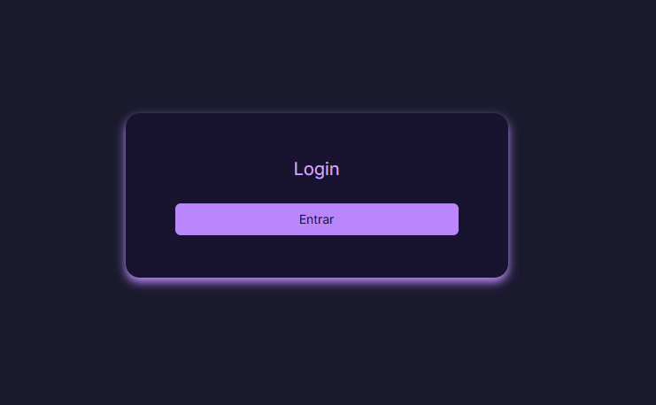
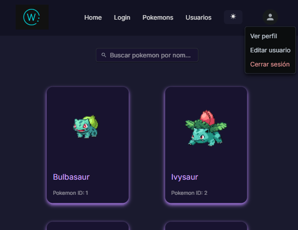
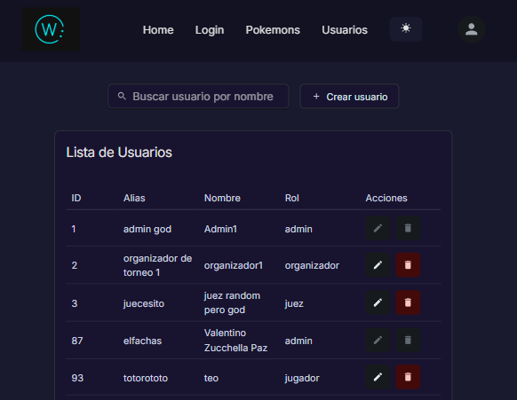
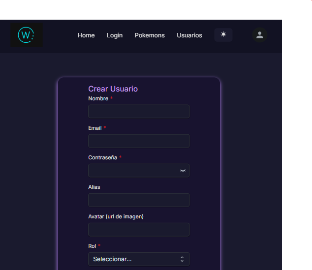

# Proyecto Torneo de Cartas y CRUD de usuarios 🃏

Proyecto fullstack que gestiona un torneo de cartas con usuarios, autenticación, roles, colección de cartas y más.






---

## 🛠️ Tecnologías Utilizadas

### Frontend

* React + TypeScript
* Redux Toolkit
* Axios + JWT Auth
* MUI Joy UI

### Backend

* .NET 8 Web API
* Entity Framework Core + MySQL
* Autenticación con JWT + Roles

---

## ⚙️ Instalación del Proyecto

### 1. Clonar el repositorio

```bash
git clone https://github.com/usuario/proyecto-torneo-cartas.git
```

### 2. Backend (.NET)

* Abrir carpeta `Trabajo final backend` con Visual Studio o VS Code.
* Restaurar paquetes NuGet.

#### Configurar cadena de conexión:

Editar `appsettings.json`:

```json
{
  "ConnectionStrings": {
    "DefaultConnection": "Server=localhost;Port=3306;User ID=admin;Password=*pass*;Database=torneo_cartas"
  }
}
```

Asegúrate de que el usuario, contraseña y nombre de base de datos coincidan con tu instancia local de MySQL.

### 3. Base de Datos MySQL

1. Abrí tu editor favorito (como HeidiSQL) y conectate a MySQL local.
2. Abrí el archivo: `backend/Trabajo final backend/configuration/DB`.
3. Ejecutá el script SQL. Si aparece un error (por dependencias faltantes o datos externos), pasá al siguiente paso.
4. Ejecutá los scripts de carga:

   * Entrá a la carpeta de los scripts `.py`.
   * Se recomienda crear un entorno virtual:

     ```bash
     python -m venv venv
     source venv/bin/activate  # o venv\Scripts\activate en Windows
     pip install *dependencias de archivos*
     ```
   * Ejecutá los archivos Python para cargar los países y las cartas.
5. Volvé a correr el archivo SQL para completar la inicialización.

### 4. Frontend (React)

```bash
cd frontend
npm install
npm run dev
```

---

## 🔐 Autenticación y Roles

* **Login** con JWT: accessToken + cookie HttpOnly con refreshToken.
* Interceptores de Axios para manejo de expiración.
* Roles: `admin`, `juez`, `organizador`, `jugador`

---

## 🚀 Funcionalidades

* Crear usuarios, editar y eliminar (según permisos)
* Gestión de colección de cartas por jugador
* Agregado de nuevas cartas a jugadores con validaciones
* Vista responsive con navegación y UI intuitiva

---

## 🧪 Comandos Útiles

```bash
# Frontend
npm run dev       # Inicia el frontend

# Backend
dotnet run        # Inicia el backend .NET
```

---

## 🤝 Créditos

Este proyecto fue desarrollado como parte de un bootcamp llevado a cabo por Extrados. ¡Gracias a todos los que aportaron feedback y testearon!

---

## 📬 Contacto

Para sugerencias o bugs: [vzucchellapaz@gmail.com](mailto:vzucchellapaz@gmail.com)
